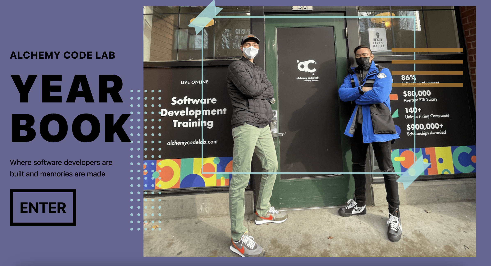

# Alchemy Yearbook

## *An app that bridges the gap in alumni networking for Alchemy students.*

# Team Members

## Kevin Do
[LinkedIn](https://www.linkedin.com/in/kdo/) [GitHub](https://github.com/kevindo1) [Portfolio](https://kevindo.dev)

## Indiana H. Holdsworth
[LinkedIn](https://www.linkedin.com/in/h-indiana-holdsworth/) [GitHub](https://github.com/H-Indiana-Holdsworth)

## Mira Kinebuchi
[LinkedIn](https://www.linkedin.com/in/mira-kinebuchi/) [GitHub](https://github.com/mira-kine)

## Mark Voltaire
[LinkedIn](https://www.linkedin.com/in/mark-voltaire/) [GitHub](https://github.com/markjvoltaire)

## Planning

Check out our [Miro board](https://miro.com/app/board/uXjVO-QZ-PQ=/?share_link_id=749603056761)

## Libraries, Frameworks, Tools used:
* React
* React-Router-Dom
* Express
* Node
* Netlify
* Heroku
* PostgreSQL
* GitHub API
* Postman
* Tailwind CSS
